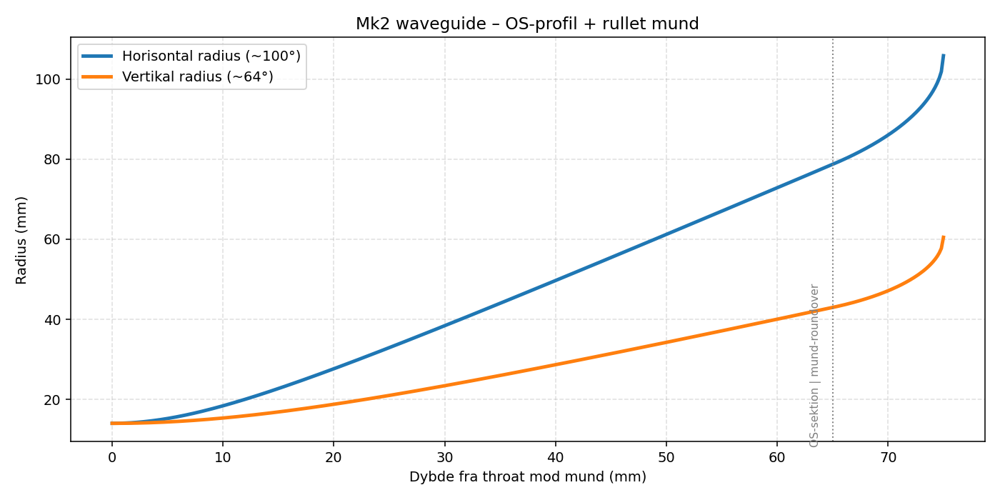

# Mk2 Design Bible – aktiv 3-vejs højttaler (optimeret udgave)

**Status:** Færdig designspec, klar til bygning af testbaffel + kabinet.
**Filosofi:** Ren retningsvirkning (directivity) skaber en jævn respons _uden_ at skulle redde den med EQ. Geometri og deling låses først – EQ kommer til allersidst og skal være minimal.

Dette er en gennemoptimeret videreudvikling af Mk1. **Enhederne er bevaret** (de er gode value-valg), men alt omkring dem – waveguide, delefrekvens, directivity-match, DSP-strategi og diffraktion – er ændret for at nå så tæt på high-end aktiv-monitor-niveau som muligt.

---

## 1. Hvad er ændret fra Mk1 → Mk2 (og hvorfor)

| Område | Mk1 | Mk2 | Hvorfor |
|---|---|---|---|
| WG-profil | `sin^exp`, åbner hurtigt ved hals | **OS (oblate spheroid)** | Konstant directivity i stedet for frekvens-afhængig spredning |
| WG-mund | 178 × 122 mm, skarp afslutning | **212 × 121 mm + rullet mund** | Horisontal kontrol ned til ~1620 Hz; mund-roundover fjerner diffraktions-ripple |
| Mid/diskant-deling | 1400 Hz (under WG-kontrol) | **~1600 Hz LR4** (i WG-kontrolbånd) | Diskanten er pattern-kontrolleret og ordentligt loadet ved delingen → ren off-axis + lav forvrængning |
| Filtre | Blandede BW2 ved 125/180 | **Akustiske LR4-targets, matchede frekvenser** | Ren summering, lav lobing, hver driver i komfortzonen |
| C-C | 158 mm | **~157 mm (uændret)** | Munden blev kun bredere, ikke højere → lobing forbliver god |
| Bas-EQ | Mild low-shelf | **Linkwitz Transform-option** | Udnytter 2×8″ headroom til dyb, kontrolleret bas |

Den vigtigste enkeltændring er **mid/diskant-delingen**. Se afsnit 3.

---

## 2. Enheder (bevaret)

- **Diskant: Scan-Speak H2606/920000** i den nye OS-waveguide. Arbejdsområde ca. 1600 Hz og op, LR4 højpas.
- **Mellemtone: Scan-Speak 15W/4434G00**, lukket kammer 5–6 L, ca. 180–1600 Hz.
- **Bas: 2 × SB Acoustics SB23NRXS45-8 pr. højttaler** (Vas 94 L, Fs 27 Hz, Qts 0,38 hver), push-push på siderne, fælles lukket ~64 L, ca. 20–180 Hz.

**Ærlig note om diskanten:** H2606 er det eneste reelle kompromis i forhold til ægte high-end (beryllium/AMT). Den er meget velegnet til waveguide og helt fin, men hvis du på et tidspunkt vil presse loftet, er en bedre waveguide-venlig diskant det eneste sted, en enhedsopgradering for alvor flytter noget. Designet kræver det ikke – det er bygget til at få det maksimale ud af H2606.

---

## 3. Kernen: directivity-match ved mid/diskant-delingen

Dette afgør, om højttaleren lyder high-end eller bare god.

**Hvad directivity faktisk gør (efter fysikbaseret modellering):**
En 15W (5,5″) er stadig **bred** ved 1600 Hz (DI ≈ 5 dB) – den begynder først at smalne for alvor omkring 2–3 kHz. En kompetent waveguide er mere retningsbestemt (DI ≈ 8 dB). Directivity-overgangen ved delingen er derfor en **glat, monoton STIGNING**, ikke en dip. Det er præcis det, man vil have: en jævnt stigende DI giver en jævn, svagt nedadgående in-room-respons (Toole/Harman-opskriften). Der er ingen energipukkel.

> Rettelse ift. tidligere note: overgangen er en stigning, ikke et fald. Den oprindelige "DI-dip/energipukkel"-beskrivelse var forkert i retningen – modellen viser en ren monoton stigning.

**Hvorfor så stadig den større mund (212 mm) og deling ved ~1600 Hz?**
Ikke pga. fladere idealiseret DI (en mindre mund delt ved 1400 Hz giver omtrent samme idealiserede DI). De reelle grunde er:

- Ved ~1600 Hz **pattern-kontrollerer og loader** den 212 mm brede mund diskanten ordentligt. En 178 mm mund delt ved 1400 Hz bruges _under_ sit kontrolbånd, hvor den virkelige off-axis-respons er irregulær, og diskanten får mindre horn-gain → arbejder hårdere → mere forvrængning (skidt for budget-H2606).
- Bedre mund-terminering på den større, rullede mund.
- Munden gøres bredere **uden** at gøres højere → bredden sætter kontrolgrænsen, højden sætter c-c. Resultat:
- Horisontal kontrol ned til **~1620 Hz** (delingen ligger ved WG'ens kontrolgrænse).
- C-C forbliver **157 mm** (munden blev ikke højere) → vertikal lobing er stadig god:

| Deling | c-c/λ | Første vertikale null |
|---:|---:|---:|
| 1500 Hz | 0,69 | ±47° |
| **1600 Hz** | **0,73** | **±43°** |
| 1700 Hz | 0,78 | ±40° |

Første null ligger langt uden for lyttevinduet (±10–15° vertikalt). Den lave mund (121 mm) giver desuden bevidst smal vertikal spredning → mindre gulv/loft-refleksion.

**Endelig delefrekvens sættes af måling** af den printede WG's DI. Designpunktet er 1600 Hz; forvent at lande i 1500–1700.

---

## 4. Waveguide Mk2

| Parameter | Værdi |
|---|---:|
| Profil | Oblate spheroid (OS) + tangent rullet mund |
| Horisontal coverage | ~100° (θ_h = 50°) |
| Vertikal coverage | ~64° (θ_v = 32°) |
| Throat | 28 mm (tilpasses H2606 – kritisk) |
| OS-dybde | 65 mm |
| Mund-roundover | 10 mm fremad (R ≈ 42 mm H / 20 mm V) |
| **Mund** | **211,7 × 121,0 mm** |
| **Samlet dybde** | **75 mm** |

**Hvorfor OS:** Profilen starter parallelt ved halsen (glat throat, ingen diffraktionskant), er nær-konisk i midten (konstant directivity), og ruller hurtigt ud ved munden, så kanten flugter med baflen (ingen mund-diffraktion). Det er det modsatte af en loading-optimeret horn-profil.

**To kritiske byggepunkter:**
1. **Throat-overgangen til H2606.** Throat-diameteren og overgangen til kalottens/forpladens udgang afgør, om du får en throat-resonans i 3–5 kHz. `throat_d` i SCAD'en er en flagget tunable – verificér mod den fysiske diskant og print testbidder.
2. **Mund-roundover ud i baflen.** WG-flangens roundover skal fortsætte glat ud i kabinettets baffel-roundover. Et spring her genindfører diffraktion.

Filen `mk2_waveguide_os.scad` er fuldt parametrisk. `$fn` er sat højt til eksport; sænk til 64 mens du itererer. Til den absolut reneste profil kan **Ath (mabats ATH4)** generere en superellipse-morphet bore – men OS-SCAD'en her er et stærkt, printbart udgangspunkt.

---

## 5. Kabinet

| Parameter | Værdi |
|---|---:|
| Højde | 1050 mm |
| Bredde | **300 mm konstant** (WG-flangen er 252 mm bred og kræver det) |
| Form | Lige tårn, store rundinger ≥25 mm på alle lodrette frontkanter |
| Dybde | 370 mm |
| Materiale | 22 mm birkefiner (foretrukket) eller MDF |
| Basvolumen | **~64 L netto, lukket** (af 84 L brutto interiør) |
| Midkammer | 5–6 L lukket, kraftigt dæmpet, mekanisk isoleret |

**Diffraktion (vigtigt for "minimal EQ"):**
- Store roundovers på topsektionens lodrette kanter (**≥ 25–30 mm**). Jo større, jo bedre.
- Lad WG-mundens roundover blende glat ind i baffel-roundoveren.
- Konstant bredde undgår det diffraktions-trin et 300→250-spring ville give. (Slank 250-krop er muligt som rent æstetisk variant, men giver kun ~50 L → Qtc ≈ 0,83 og kræver mere LT-boost.)
- Eventuelt filt/skum omkring 15W'eren.

**Afstivning:** Push-push lægger kræfter i sidepanelerne. Brug window-/matrix-afstivning, der binder siderne sammen ved basserne, plus en hyldeafstivning under midkammeret og front-til-bag-afstivning. Mål: dødt kabinet.

**Midkammer:** Stift, fuldt isoleret fra bastrykket, kraftigt stoppet. 15W (Vas 12,8 L) i ~6 L → den deles ved 180 Hz alligevel, så kammer-Q er underordnet.

---

## 6. Bas-alignment og dynamik

To SB23 (Vas 94 L hver → Vas_total 188 L) i fælles ~64 L lukket:

- α = Vas_total/Vb = 188/64 ≈ 2,94
- **Qtc ≈ 0,75**, **Fc ≈ 54 Hz** → stramt og veldæmpet, tæt på maksimalt fladt. (Rettelse: en tidligere note sagde Qtc 0,70/45 Hz baseret på et forkert Vas på ~55 L; databladets Vas er 94 L.)
- F3 ≈ 50–55 Hz anekoisk, lavere i rum pga. room gain; LT trækker bunden ned mod ~30 Hz.

**Dynamik:** To 8″-membraner = ~264 cm³ ensidigt udsving = stor headroom. I aktiv kan du erstatte den milde low-shelf med en **Linkwitz Transform** (target ~Fc 30 Hz, Q 0,7) + beskyttende subsonic HP ved ~18 Hz, og presse bunden dybt med fuld kontrol. Det er her, bassen bliver genuint high-end-dynamisk.

**Ærlig flaskehals:** Den enkelte 15W til 180–1600 Hz er systemets SPL-loft – det mest ørefølsomme bånd dækkes af én 5,5″. Bas og diskant har masser af headroom; midten komprimerer først ved høje niveauer. Det er prisen for 3-vejs med én mellemtone, og det er dér, mega-højttalere med større/dobbelte mid'er trækker fra. Hold bas/mid ved 180 Hz (ikke højere), så midten ikke spilder udsving på frekvenser, bassen kan tage.

---

## 7. DSP – ren summering, minimal EQ

Princippet: sigt efter **akustiske LR4-targets** ved **matchede frekvenser**, _efter måling_. Det elektriske filter ≠ det akustiske – hver drivers egen rolloff tæller med, så DSP'en former summen til LR4.

| Vej | Akustisk target | Frekvens | Formål |
|---|---|---:|---|
| 2×SB23 | Subsonic HP / LT | ~18 Hz HP (+ LT ~30 Hz Q0,7) | Beskyttelse + dyb kontrolleret bas |
| 2×SB23 | LR4 LP | ~180 Hz | Stejl overgang, holder mid fri af bastryk |
| 15W mid | LR4 HP | ~180 Hz | Samme frekvens → ren summering |
| 15W mid | LR4 LP | **~1600 Hz** | Lander i WG-kontrolbånd |
| H2606 + WG | LR4 HP | **~1600 Hz** | Directivity-match, lav forvrængning |

**Tidsjustering:** Mål akustiske centre og delay den forreste driver. WG'ens dybe throat trækker diskantens akustiske center bagud, hvilket _hjælper_ med at flugte med 15W'eren – udnyt det til et rent steprespons.

**FIR / lineær fase (high-end-greb):** Hvis DSP'en kan FIR (miniDSP Flex med FIR, eller CamillaDSP på en lille PC), giver transient-perfekte delinger et rent steprespons – en konkret high-end-differentiator, der passer direkte til dynamik-målet.

**EQ til sidst:** Kun let korrektion af rest-on-axis efter directivity og akustiske targets sidder. Baffelstep håndteres som almindelig tonal balance (bred niveaubalance mod en svagt nedadgående in-room target), ikke som et separat problem.

---

## 8. Forstærkning og elektronik

- **Fuldt aktivt, 3 forstærkerkanaler pr. højttaler** (bas / mid / diskant) fra DSP.
- Bas: 2 × SB23 i parallel = 4 Ω på én kanal (vælg forstærker, der er komfortabel ved 4 Ω).
- DSP-forslag: **miniDSP Flex (helst FIR-kapabel)** pr. højttaler, eller en 8-kanals enhed til parret. Alternativt CamillaDSP + multikanals DAC for fuld FIR-frihed.
- Niveau-match i DSP: midten (~89.7 dB) sætter systemets reference; bassen får +6 dB headroom (parallel), diskanten i WG dæmpes ned.

---

## 9. Forventet ydelse (realistisk)

Ikke ±0,65 dB-fantasi – men det her er opnåeligt med ordentlige målinger:

- **On-axis:** flad inden for ~±1–1,5 dB, 100 Hz–10 kHz, efter måling + targets.
- **Directivity:** glat, kontrolleret ~100° H / ~64° V → in-room respons med naturlig, jævn nedadgående hældning (Toole/Harman-opskriften på "neutral high-end").
- **Bas:** F3 ~50–55 Hz anekoisk, ~30 Hz i rum med LT; ~105+ dB-spidser nede.
- **Dynamik:** fremragende i bas og diskant; midten er loftet (~system-spidser i 105–108 dB-klassen ved 1 m før mid-strain – stadig højt).
- **Kabinet:** meget lav resonans (push-push).

Realistisk mål: directivity- og neutralitets-mæssigt i selskab med Neumann KH / Genelec "The Ones" / Dutch & Dutch-klassen, _hvis_ WG og målinger udføres ordentligt. Caveat: succes afhænger af faktiske målinger, og H2606 sætter loftet for ultimativ diskant-raffinement vs. de dyreste.

---

## 10. Byggerækkefølge

1. Print waveguide Mk2 (start med throat-testbidder mod den fysiske H2606).
2. Byg testbaffel (300 mm bred) med WG + 15W ved c-c ~160 mm.
3. Mål H2606 i WG: 0/15/30/45/60° horisontalt og ±10/±20° vertikalt.
4. Mål 15W på baflen, samme vinkler.
5. Bestem endelig mid/diskant-deling ud fra DI-match (forvent 1500–1700 Hz).
6. Mål bas (nærfelt + samlet), sæt LT og bas/mid-deling.
7. Akustiske LR4-targets + delay i DSP; tjek summering og steprespons.
8. Først nu: lås kabinet og DSP, og læg evt. let rest-EQ.

---

## 11. Filer i pakken

- `mk2_design_bible.md` (dette dokument)
- `mk2_waveguide_os.scad` – parametrisk OS-waveguide
- `mk2_waveguide_profil.png` – verificeret profil
- `mk2_kabinet_tegning.png` – opdaterede mål
- `mk2_parametre.csv`
- `mk2_dsp.csv`

---

## 12. Kort konklusion

Mk2 flytter projektet fra "rigtig god DIY" mod ægte high-end ved at gøre ét ved kernen: **få directivity ren ved delingen**, så responsen er jævn af sig selv og kun behøver minimal EQ. Den bredere OS-waveguide + ~1600 Hz LR4 + akustiske targets + tidsjustering er hele forskellen. Resten – bas, kabinet, dynamik – var allerede stærkt og er nu låst og skarpere.

Det vigtigste nu: **print, mål, og lad målingerne sætte den sidste delefrekvens.** Geometrien er bygget, så det kan lykkes.
